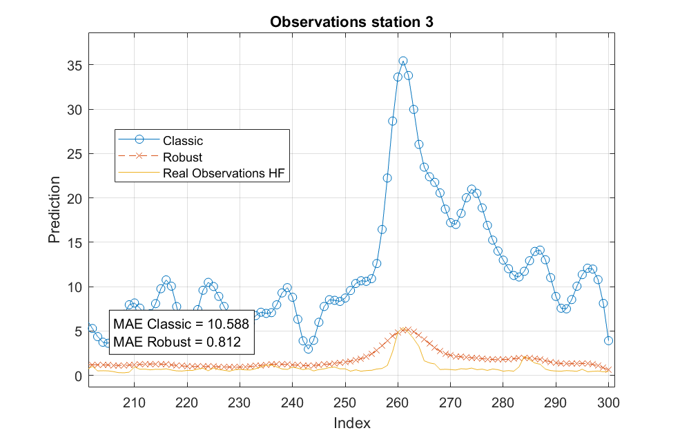

# Robust Multi-Fidelity Modelling

This repository contains experiments comparing a **classic multi-fidelity Gaussian process (MF-GP)** model with a **robust multi-fidelity Gaussian process (Robust MF-GP)**.  
The goal is to evaluate whether the robust formulation improves predictions, especially when low-fidelity (LF) data contain anomalies or extreme values.

The script "Comaprison_ClassicvsRobust.m" run a comparison between the two approaches. The utilities folder contains the related functions.

---

## 🔍 Main Idea

Multi-fidelity Gaussian process modelling combines **high-fidelity (HF)** and **low-fidelity (LF)** data to build efficient surrogates.  
- The **classic MF-GP** works well when LF and HF data are consistent.  
- The **robust MF-GP** is designed to handle situations where LF data may contain **outliers or extreme values**, providing more stable predictions.

We compare the two approaches by looking at:
- **Predictions vs. real HF observations**  
- **Mean Absolute Error (MAE)** for each method  

---

## 🧪 Experiments

### **Experiment 1 — Clean LF data**
In this case, the LF data are relatively well-behaved (no extreme anomalies).  
Even here, the robust model shows slightly better interpolation quality.  

---

### **Experiment 2 — Corrupted LF data**
Here, we deliberately introduce **extreme anomalies** into the LF data (multiplying part of the dataset by a large factor).  
The classic MF-GP is strongly affected, while the robust MF-GP maintains much better predictive performance.  

---

## 📊 Observations
- **Classic MF-GP**: Sensitive to outliers in the LF dataset.  
- **Robust MF-GP**: Provides more reliable predictions and lower error in both clean and corrupted settings.  

---

## 📂 Repository Structure
- `ModelInfo.mat` — Data object with training and testing sets.  
- `*.m` — MATLAB scripts to run the experiments.  
- `images/` — Folder containing the result plots (`experiment1.png`, `experiment2.png`).  

---

## ⚡ How to Run
1. Clone the repository and open it in MATLAB.  
2. Ensure `ModelInfo.mat` is in your path.  
3. Run the scripts to reproduce the experiments.  
4. Figures will be saved in the `images/` folder.  

---

## ✨ Conclusion
The experiments confirm that **robust multi-fidelity modelling** can significantly improve predictive performance, especially when LF data are corrupted or contain anomalies.
